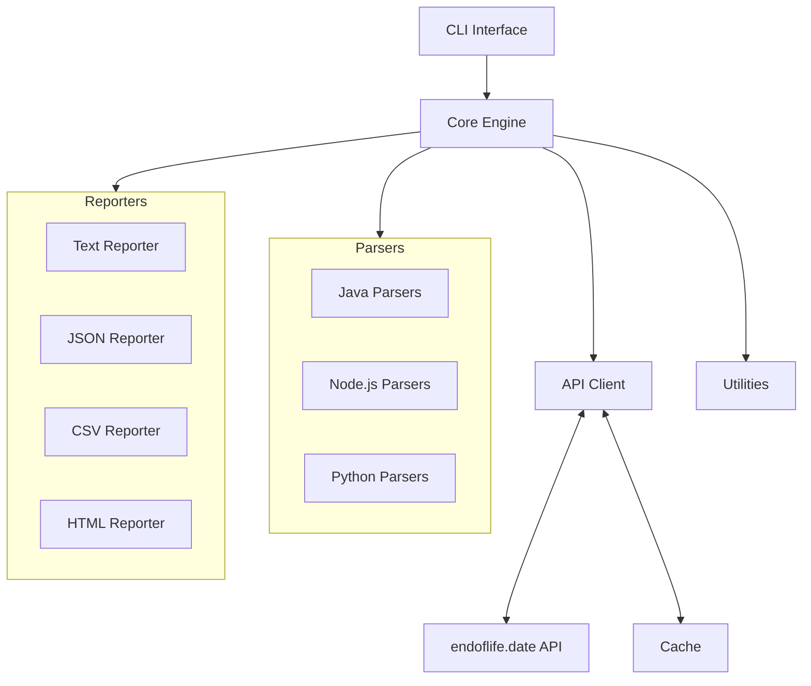
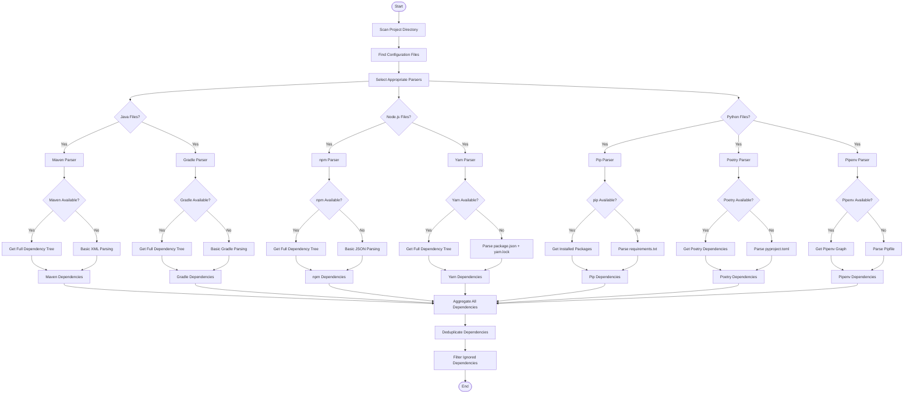
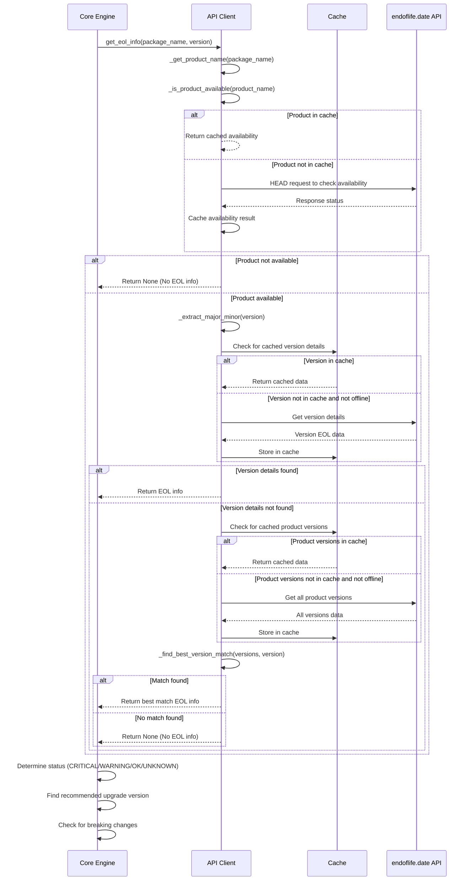
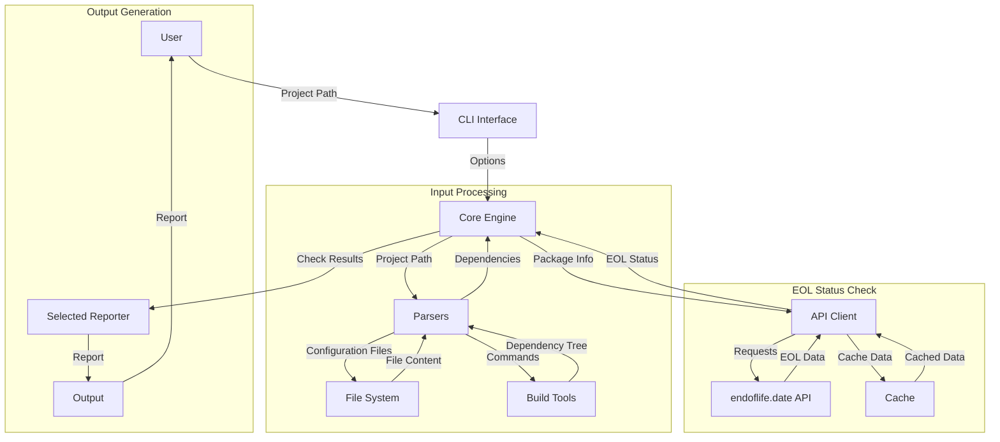
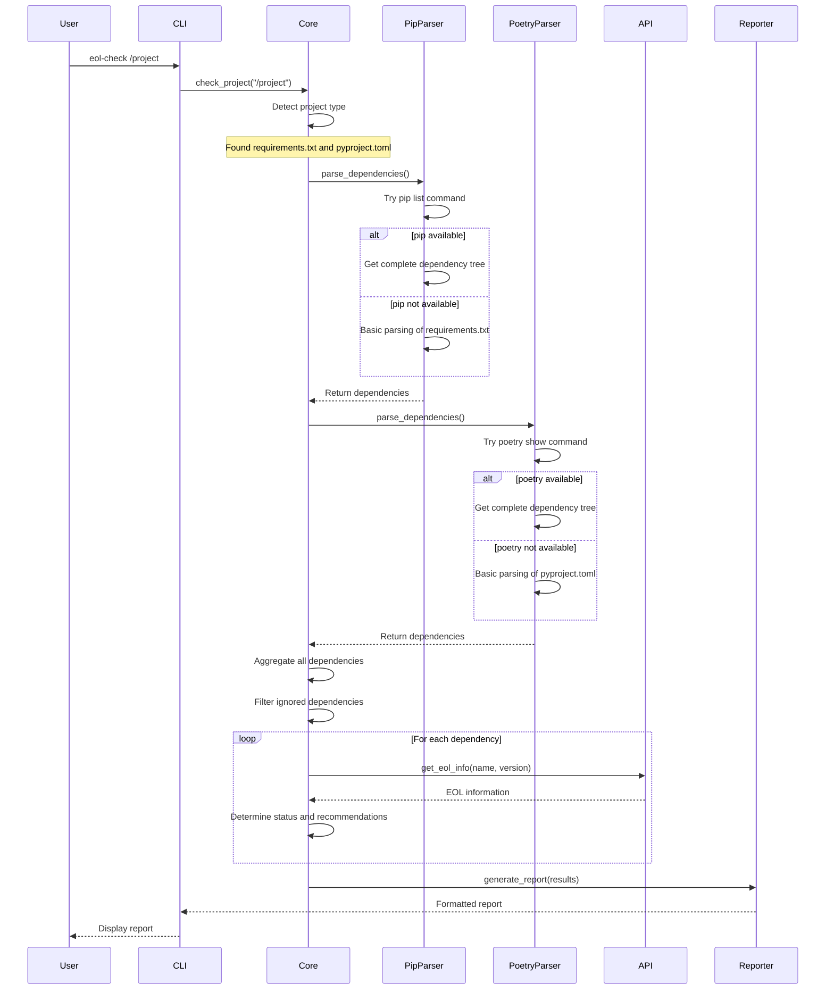

# End of Life Checker - Architecture Design

This document describes the architecture and design of the End of Life Checker tool, explaining the key components, their interactions, and the overall workflow.

## System Overview

End of Life Checker is a command-line tool designed to identify dependencies in software projects that are approaching or have reached their end-of-life (EOL) dates. The tool supports multiple programming languages and project types, providing a unified interface for checking EOL status across different technology stacks.

## High-Level Architecture

The system is organized into the following main components:

## Component Details

### CLI Interface

The CLI interface handles command-line arguments, validates inputs, and orchestrates the overall execution flow. It's responsible for:

- Parsing command-line options
- Validating the project path
- Initializing the core engine with appropriate settings
- Selecting the appropriate reporter based on the requested format
- Handling output (stdout or file)
- Setting appropriate exit codes

### Core Engine

The core engine is the central component that coordinates the dependency checking process. It:

- Detects project types and selects appropriate parsers
- Aggregates dependencies from all parsers
- Filters dependencies based on ignore lists
- Checks EOL status for each dependency
- Determines dependency status (CRITICAL, WARNING, OK, UNKNOWN)
- Identifies recommended upgrade versions
- Detects potential breaking changes in upgrades
- Tracks execution time and progress

### Parsers

Parsers are responsible for extracting dependency information from project files. Each parser is specialized for a specific project type:

#### Java Parsers

- **Maven Parser**: Parses `pom.xml` files
  - Basic parsing: Extracts direct dependencies, parent POM, Java version
  - Advanced parsing: Uses `mvn dependency:tree` to get the complete dependency tree including transitive dependencies

- **Gradle Parser**: Parses `build.gradle` files
  - Basic parsing: Extracts direct dependencies and Java version
  - Advanced parsing: Uses `gradle dependencies` to get the complete dependency tree

#### Node.js Parsers

- **npm Parser**: Parses `package.json` files
  - Basic parsing: Extracts dependencies, devDependencies, and Node.js version
  - Advanced parsing: Uses `npm list --json --all` to get the complete dependency tree

- **Yarn Parser**: Parses `package.json` and `yarn.lock` files
  - Basic parsing: Extracts dependencies from package.json and precise versions from yarn.lock
  - Advanced parsing: Uses `yarn list --json` to get the complete dependency tree

#### Python Parsers

- **Pip Parser**: Parses `requirements.txt` files
  - Basic parsing: Extracts direct dependencies
  - Advanced parsing: Uses `pip list --format=json` to get all installed packages

- **Poetry Parser**: Parses `pyproject.toml` files
  - Basic parsing: Extracts dependencies and dev-dependencies
  - Advanced parsing: Uses `poetry show --no-ansi` to get the complete dependency tree

- **Pipenv Parser**: Parses `Pipfile` files
  - Basic parsing: Extracts packages and dev-packages
  - Advanced parsing: Uses `pipenv graph --json` to get the complete dependency tree

### API Client

The API client interfaces with the endoflife.date API to retrieve EOL information for dependencies. It:

- Maps package names to endoflife.date product names
- Checks product availability in the API
- Retrieves EOL information for specific versions
- Handles API errors gracefully
- Implements caching to reduce API calls
- Supports offline mode using cached data

### Reporters

Reporters generate formatted output based on the check results:

- **Text Reporter**: Generates human-readable plain text reports with emoji status indicators
- **JSON Reporter**: Generates structured JSON output for programmatic consumption
- **CSV Reporter**: Generates CSV files for spreadsheet analysis
- **HTML Reporter**: Generates HTML reports with styling and interactive features

### Utilities

Utility modules provide common functionality used across the system:

- **Cache**: Implements caching for API responses
- **Version**: Provides version parsing, comparison, and normalization functions

## Detailed Architecture Diagrams

### Parser Selection and Dependency Resolution

### EOL Status Check Process

### Data Flow Diagram

### Component Interaction for Multiple Parser Scenario

## Workflow and Dependency Resolution Logic

### Project Analysis Workflow

1. **Project Type Detection**:
   - The core engine scans the project directory for configuration files
   - Based on the files found, appropriate parsers are selected

2. **Dependency Extraction**:
   - Each selected parser extracts dependencies from its respective configuration files
   - All extracted dependencies are aggregated into a single list

3. **Dependency Resolution**:
   - For each project type, a specific dependency resolution strategy is applied

4. **EOL Status Check**:
   - For each dependency, the API client retrieves EOL information
   - Based on the EOL date and current date, a status is assigned

5. **Report Generation**:
   - Dependencies are sorted by status (CRITICAL first, then WARNING, OK, and UNKNOWN)
   - The selected reporter generates the output in the requested format

### Dependency Resolution Logic by Project Type

#### Java Projects

1. **Basic Parsing**:
   - Parse configuration file (`pom.xml` or `build.gradle`)
   - Extract direct dependencies and Java version

2. **Complete Dependency Tree Analysis**:
   - Execute build tool command to get the complete dependency tree
     - Maven: `mvn dependency:tree`
     - Gradle: `gradle dependencies`
   - Parse the command output to extract all dependencies
   - If command execution fails, fall back to basic parsing results

3. **Dependency Deduplication**:
   - Use unique keys (`group_id:artifact_id:version`) to eliminate duplicates
   - Mark dependencies as direct or transitive

#### Node.js Projects

1. **Basic Parsing**:
   - Parse `package.json` to extract direct dependencies
   - Extract Node.js version from `engines` field if specified

2. **Version Refinement** (Yarn projects):
   - Parse `yarn.lock` to get precise version information
   - Update versions from basic parsing with more precise ones

3. **Complete Dependency Tree Analysis**:
   - Execute package manager command to get the complete dependency tree
     - npm: `npm list --json --all`
     - yarn: `yarn list --json --no-progress`
   - Parse the command output to extract all dependencies
   - If command execution fails, fall back to basic parsing results

4. **Dependency Deduplication**:
   - Use unique keys (`name:version`) to eliminate duplicates
   - Mark dependencies as direct or transitive

#### Python Projects

1. **Basic Parsing**:
   - Parse configuration file (`requirements.txt`, `Pipfile`, or `pyproject.toml`)
   - Extract direct dependencies

2. **Complete Dependency Tree Analysis**:
   - Execute package manager command to get the complete dependency tree
     - pip: `pip list --format=json`
     - poetry: `poetry show --no-ansi`
     - pipenv: `pipenv graph --json`
   - Parse the command output to extract all dependencies
   - If command execution fails, fall back to basic parsing results

3. **Dependency Deduplication**:
   - Use unique keys (`name:version`) to eliminate duplicates
   - Mark dependencies as direct or transitive

### EOL Status Check Process

1. **Package Name Mapping**:
   - Map package name to endoflife.date API product name
   - Check if the product is available in the API

2. **EOL Information Retrieval**:
   - Try to get EOL information for the specific version
   - If that fails, try to get all versions and find the best match
   - If still no match, mark as "UNKNOWN"

3. **Status Determination**:
   - If EOL date is in the past: "CRITICAL"
   - If EOL date is within threshold days: "WARNING"
   - If EOL date is beyond threshold days: "OK"
   - If no EOL information: "UNKNOWN"

4. **Upgrade Recommendation**:
   - For "CRITICAL" and "WARNING" dependencies, find recommended upgrade versions
   - Check if upgrade involves a major version change (breaking change)

## Error Handling and Fallback Strategies

The system implements several fallback strategies to ensure robustness:

1. **Parser Fallbacks**:
   - If advanced dependency resolution fails (e.g., command execution error), fall back to basic parsing
   - If multiple parsers are applicable, aggregate results from all of them

2. **API Client Fallbacks**:
   - If specific version lookup fails, try to find the best match from all versions
   - If product is not available in the API, mark dependencies as "UNKNOWN"
   - In offline mode, use cached data or mark as "UNKNOWN" if no cache exists

3. **Error Reporting**:
   - In verbose mode, print detailed error information
   - In normal mode, handle errors gracefully without interrupting the process

## Performance Considerations

1. **Caching**:
   - API responses are cached to reduce network calls
   - Product availability checks are cached to avoid repeated HEAD requests

2. **Parallel Processing**:
   - Future enhancement: Process dependencies in parallel for faster execution

3. **Progress Tracking**:
   - Display progress bar during dependency checking
   - Show execution time in the final report

## Security Considerations

1. **No Remote Code Execution**:
   - All commands are executed with fixed arguments, no user input is passed directly to command execution

2. **Local Operation**:
   - The tool operates entirely on the local filesystem and only makes API calls to endoflife.date

3. **Data Privacy**:
   - No project data is sent to external services except for package names and versions to the endoflife.date API
